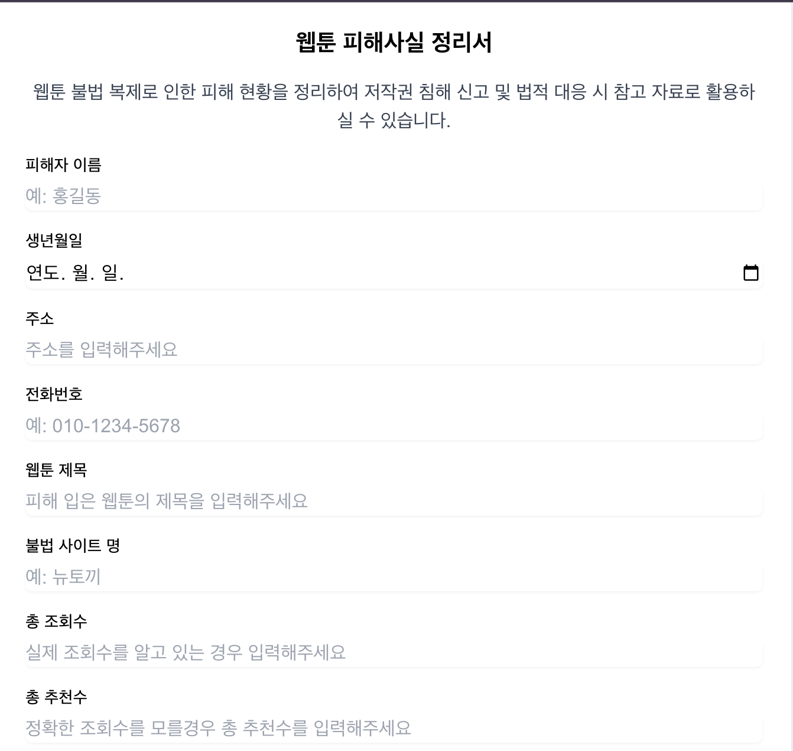

# Webtoon Guard

웹툰 작가를 위한 피해사실 정리 및 법적 대응 지원 도구입니다.

## 프로젝트 소개

### 목적
웹툰 불법 복제는 작가들의 창작 의욕을 저하시키고 웹툰 산업의 건전한 발전을 저해하는 심각한 문제입니다. 법적 대응을 위해서는 구체적인 피해 사실 증명이 필요한데, 이는 개별 작가들이 정리하기에 쉽지 않은 작업입니다.

본 프로젝트는 작가들이 받은 피해를 보다 쉽게 정량화하고 문서화할 수 있도록 지원하여, 실질적인 법적 대응이 가능하도록 돕는 것을 목적으로 합니다.

### 의의
- 불법 복제로 인한 피해 규모의 가시화
- 법적 대응을 위한 기초 자료 제공
- 웹툰 작가들의 권리 보호 지원

## 주요 기능

- 불법 사이트의 조회수/추천수 기반 피해액 산정
- 피해사실 정리서 PDF 자동 생성
- 다양한 법적 대응 용도별 문서 생성 지원

## 사용 방법

본 서비스는 웹툰 작가 및 관계자분들을 위한 것으로, 별도의 설치 없이 웹 브라우저에서 바로 사용하실 수 있습니다.

1. 피해자 정보 입력
   - 이름, 생년월일, 연락처 등 기본 정보 입력
   - 피해 입은 웹툰 작품명 입력

2. 피해 현황 입력
   - 불법 사이트명 입력
   - 확인된 조회수 또는 추천수 입력
   - 회차당 정상 구매 가격 입력

3. 피해액 산정
   - 입력된 정보를 바탕으로 예상 피해액 자동 계산

4. 문서 생성
   - 용도에 맞는 문서 양식 선택
   - PDF 형태의 피해사실 정리서 자동 생성

## 스크린샷

## 향후 개발 계획

- 작가 맞춤형 법적 대응 안내 챗봇 개발
- 다양한 문서 템플릿 추가
- 피해 사례 데이터베이스 구축 (작가 동의 하에)
- 통계 분석 기능 추가

## 기술 스택

- Next.js
- React
- Tailwind CSS
- jsPDF
- html2canvas

## 설치 방법 (개발자용)

bash

git clone https://github.com/your-username/webtoon-guard.git

cd webtoon-guard

npm install

npm run dev

## 라이선스

MIT License

## 기여하기

버그를 발견하시거나 새로운 기능을 제안하고 싶으시다면 Issue를 생성해주세요.
Pull Request도 환영합니다!

## 연락처

프로젝트에 대한 문의사항이 있으시다면 [이슈](https://github.com/EXPOIR0405/webtoon-guard/issues)를 생성해주세요.
